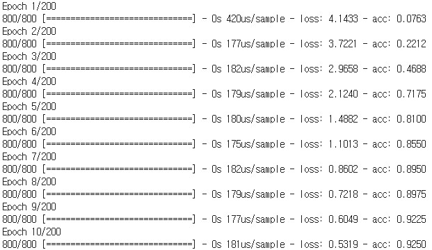

Text Generation using Keras Word RNNLM
===========================================

Keras implementation of Word-Level Recurrent Neural Network Language Model.  
https://www.isca-speech.org/archive/interspeech_2010/i10_1045.html  
Using About Wikipedia page.  
https://en.wikipedia.org/wiki/Wikipedia:About
	
    Recurrent Neural Network Based Language Model
    Mikolov Tomáš, Karafiát Martin, Burget Lukáš, Černocký Jan, Khudanpur, Sanjeev
    INTERSPEECH 2010

Training Usage
-----

    python TrainingModel.py train_data_file output_model_file output_tokenizer_file output_sequence_len_file

    ex)
    python TrainingModel.py ./data/train_data.txt ./model/rnnlm_model.h5 ./model/tokenizer.pickle
        ./model/sequence_len.txt

Training Result
-----

Generation Usage
-----

    python PredictSentence.py input_model_file input_tokenizer_file input_sequence_len_file
        "input_sentence" output_word_count

    ex)
    python PredictSentence.py ./model/rnnlm_model.h5 ./model/tokenizer.pickle ./model/sequence_len.txt
        "wikipedia" 8

Generation Result
-----

